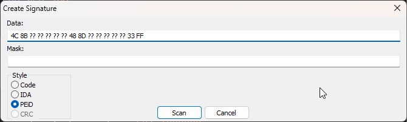

# YASS

Yet another signature scanner. There are two projects in here, `PatternScanner`, a C++ library for signature scanning memory for byte patterns. `CSPatternScanner` a C# project which can automate the process of finding many signatures in files and writing them to a C++ header file automatically.

Supports PEiD-style signatures directly from x64dbg plugin [SwissArmyKnife](https://github.com/Nukem9/SwissArmyKnife/releases). 



## PatternScanner (C++)

```cpp
#include "lib/SigScanner.h"

int main() {
  // Create a scanner for a module by name
  SigScanner scanner("ntdll");

  // Scan - throws if not found
  auto addr = scanner.Scan("83 3D ?? ?? ?? ?? ?? 74 0E 8B ?? ?? ?? ?? ?? FF 15 ?? ?? ?? ?? FF E1 8D");
}
```

## CSPatternScanner (C#)

C# program to scan for multiple file signatures and generate a C++ header file containing found offsets.

### Usage

The following command will generate a `signatures.h` file containing the found offsets:

`CSPatternScanner.exe -s signatures.json -o signatures.h -f "C:\Windows\SysWOW64\notepad.exe"`

Sample `signatures.json` file

```JSON
[
	{
		"name": "Notepad32_1",
		"pattern": "BA 03"
	},
	{
		"name": "Notepad32_2",
		"pattern": "FF 35 ?? ?? ?? ?? 8B ?? ?? ?? ?? ?? 8B ?? ?? ?? ?? ?? E8 ?? ?? ?? ?? 8D"
	}
]
```

Output signatures.h file
```cpp
// This file was generated automatically by CSPatternScanner.exe

#define Notepad32_1 0x109AD; // 
#define Notepad32_2 0x1129A; // 
```


